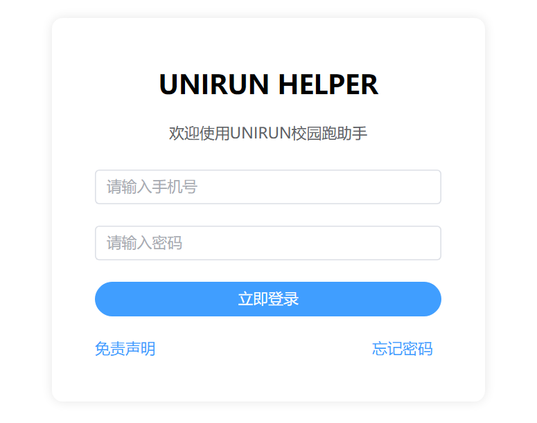
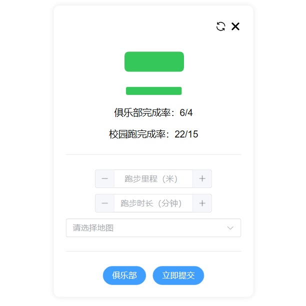
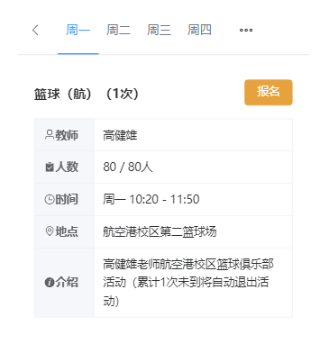
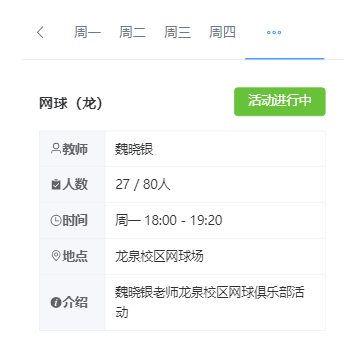

# UNIRUN校园跑助手网页版

UNIRUN校园跑助手网页版，自动规划跑步路径，生成跑步记录。

| 地图支持                    |
| --------------------------- |
| 成都信息工程大学（航空港校区） |
| 成都信息工程大学（龙泉校区） |
| 成都中医药大学（温江校区） |
| ...                         |

## 使用

- [Cloudflare](https://unirun.pages.dev)

- [Vercel](https://unirun.vercel.app)

   

## 运行

安装依赖：

```bash
npm install
```

运行调试：

```bash
npm run serve
```

打包：

```bash
npm run build
```

## 主要API

| Name |Url |
| -------- | -------- |
| baseURL | https://run-lb.tanmasports.com/v1 |
| 登录 | `${baseURL}/auth/login/password` |
| 用户信息 | `${baseURL}/auth/query/token` |
| 完成率信息 | `${baseURL}/clubactivity/getJoinNum` |
| 标准信息 | `${baseURL}/unirun/query/runStandard` |
| 新纪录 | `${baseURL}/unirun/save/run/record/new` |
| 俱乐部信息 | `${baseURL}/clubactivity/querySemesterClubActivity` |
| 俱乐部参与记录 | `${baseURL}/clubactivity/queryMyActivityList` |
| 待签到俱乐部 | `${baseURL}/clubactivity/queryMySemesterClubActivity` |
| 俱乐部加入退出状态 | `${baseURL}/clubactivity/joinOrCancelSchoolSemesterActivity` |

> Workerjs

```
addEventListener('fetch', event => {
  event.respondWith(handleRequest(event.request))
})

async function handleRequest(request) {
  const url = new URL(request.url)
  const backendUrl = 'https://run-lb.tanmasports.com/v1' + url.pathname + url.search

  // 克隆请求的头部
  const newHeaders = new Headers(request.headers)

  // 删除可能影响签名的头部
  newHeaders.delete('Host')

  const init = {
    method: request.method,
    headers: newHeaders,
    // 获取并克隆请求体，以确保传递原始的内容
    body: request.method === 'GET' ? null : await request.clone().text()
  }

  const response = await fetch(backendUrl, init)

  const responseHeaders = new Headers(response.headers)
  responseHeaders.set('Access-Control-Allow-Origin', '*')
  responseHeaders.set('Access-Control-Allow-Methods', 'GET, POST, PUT, DELETE, OPTIONS')
  responseHeaders.set('Access-Control-Allow-Headers', '*')

  const body = await response.text()
  return new Response(body, {
    status: response.status,
    headers: responseHeaders
  })
}
```

# 免责声明

使用本工具所产生的任何后果，用户需自行承担。

本工具仅供学习交流使用，不得用于任何商业用途。
