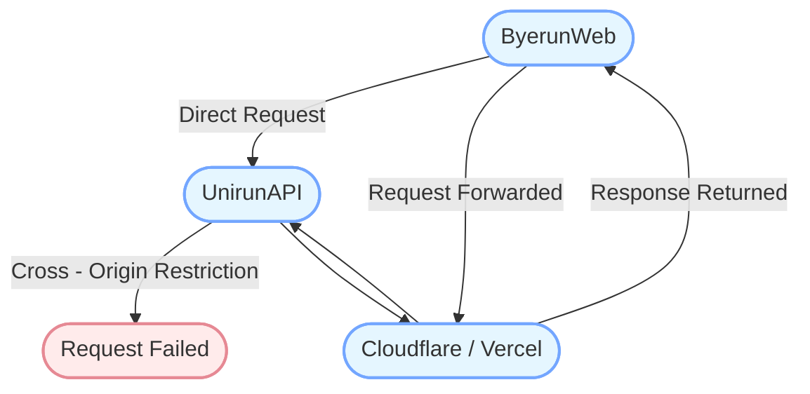

<p align="center">
  <a href="https://byerun.pages.dev" target="_blank" rel="noopener noreferrer">
    
  </a>
</p>

<h1 align="center"/>Byerun <sup><em>web</em></sup></h1>

<p align="center">
Goodbye Unirun - 校园跑助手网页版🏃‍♂️
</p>

## 支持的地图

| 学校名称 |
| --- |
| [成都信息工程大学](https://cuit.edu.cn/) |
| [成都中医药大学](https://cdutcm.edu.cn/) |
| [四川邮电职业技术学院](https://www.sptc.edu.cn/) |
| [四川工商职业技术学院](https://www.sctbc.net/) |
| [四川南充卫生学校](http://www.ncwsxx.com/) |
| [广安职业技术学院](https://www.gavtc.edu.cn/) |
| [...]()|

### 地图数据
[高德地图坐标拾取](https://lbs.amap.com/tools/picker)


## Demo

| 部署平台 |  |  |
| --- | --- | --- |
| Cloudflare | [Byerun](https://byerun.pages.dev) | [Unirun](https://unirun.pages.dev) |
| Vercel | [Byerun](https://byerun.vercel.app) | [Unirun](https://unirun.vercel.app) |


## 本地构建

进入项目文件夹:

```bash
cd app
```

安装依赖:

```bash
npm install
```

开发调试:

```bash
npm run dev
```

构建:

```bash
npm run build
```

## 代理

进入代理文件夹:

```bash
cd server
```

安装依赖:

```bash
npm install
```

启动代理:

```bash
npm run start
```


**支持在 Cloudflare 和 Vercel 上部署代理，避免源服务器的跨域限制。**



### Cloudflare Worker

```
export default {
  async fetch(request, env) {
    if (request.method === 'OPTIONS') {
      return new Response(null, {
        status: 200,
        headers: {
          'Access-Control-Allow-Origin': '*',
          'Access-Control-Allow-Methods': 'GET, POST, PUT, DELETE, OPTIONS',
          'Access-Control-Allow-Headers': '*'
        }
      });
    } else {
      return handleRequest(request, env);
    }
  }
};

async function handleRequest(request, env) {
  const url = new URL(request.url);
  const backendUrl = 'https://run-lb.tanmasports.com/v1' + url.pathname + url.search;

  const newHeaders = new Headers(request.headers);
  newHeaders.delete('Host');

  const init = {
    method: request.method,
    headers: newHeaders,
    body: request.method === 'GET' ? null : await request.clone().text()
  };

  const response = await fetch(backendUrl, init);

  const responseHeaders = new Headers(response.headers);
  responseHeaders.set('Access-Control-Allow-Origin', '*');
  responseHeaders.set('Access-Control-Allow-Methods', 'GET, POST, PUT, DELETE, OPTIONS');
  responseHeaders.set('Access-Control-Allow-Headers', '*');

  const body = await response.text();

  return new Response(body, {
    status: response.status,
    headers: responseHeaders
  });
}
```

## 声明

本项目仅供学习研究使用，不得用于任何商业或非法用途。如需体验完整功能，请使用官方应用。

## 致谢

[@msojocs/AutoRun](https://github.com/msojocs/AutoRun)

## 许可

Byerun 基于 [CC BY-NC License, Version 4.0](https://creativecommons.org/licenses/by-nc/4.0/) 发布。

