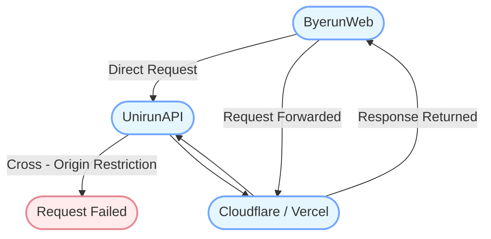

<p align="center">
  <a href="https://byerun.pages.dev" target="_blank" rel="noopener noreferrer">
    
  </a>
</p>

<h1 align="center"/>Byerun <sup><em>web</em></sup></h1>

<p align="center">
Goodbye Unirun - 校园跑助手🏃‍♂️
</p>
<p align="center">
<i>身体是革命的本钱 别让打卡磨灭了你对运动的热情</i>
</p>

<p align="center">
<i>一键完成记录 / 云端定时任务 / 在线反馈社区 / 校友圈 </i>
</p>

## 支持的地图

| 学校名称                                          |
| ------------------------------------------------- |
| [成都信息工程大学](https://cuit.edu.cn/)          |
| [成都中医药大学](https://cdutcm.edu.cn/)          |
| [四川邮电职业技术学院](https://www.sptc.edu.cn/)  |
| [四川工商职业技术学院](https://www.sctbc.net/)    |
| [四川南充卫生学校](http://www.ncwsxx.com/)        |
| [广安职业技术学院](https://www.gavtc.edu.cn/)     |
| [川北幼儿师范](https://cbyz.edu.cn/)              |
| [唐山工业职业技术大学](https://www.tsgzy.edu.cn/) |
| [...](...)                                        |

<i>需要更多地图欢迎反馈添加<i>

## 使用

| 部署平台   |                                     |                                     |
| ---------- | ----------------------------------- | ----------------------------------- |
| Cloudflare | [Byerun](https://byerun.pages.dev)  | [Unirun](https://unirun.pages.dev)  |
| Vercel     | [Byerun](https://byerun.vercel.app) | [Unirun](https://unirun.vercel.app) |

## 本地构建

进入项目文件夹:

```bash
cd app
```

安装依赖:

```bash
npm install
```

开发调试:

```bash
npm run dev
```

构建:

```bash
npm run build
```

## 代理

进入代理文件夹:

```bash
cd server
```

安装依赖:

```bash
npm install
```

启动代理:

```bash
npm run start
```

**支持在 Cloudflare 和 Vercel 上部署代理，避免源服务器的跨域限制。**


```mermaid
graph TD;

    classDef process fill:#E5F6FF,stroke:#73A6FF,stroke-width:2px;

    classDef error fill:#FFEBEB,stroke:#E68994,stroke-width:2px;


    A([ByerunWeb]):::process -->|Direct Request| U([UnirunAPI]):::process

    U --> |Cross - Origin Restriction| E([Request Failed]):::error

    A -->|Request Forwarded | C([Cloudflare / Vercel]):::process

    C --> U

    U --> C

    C --> |Response Returned| A
```

## 声明

本项目仅供学习研究使用，不得用于任何商业或非法用途。如需体验完整功能，请使用官方应用。

## 致谢

[@msojocs/AutoRun](https://github.com/msojocs/AutoRun)

## 许可

Byerun 基于 [CC BY-NC License, Version 4.0](https://creativecommons.org/licenses/by-nc/4.0/) 发布。
